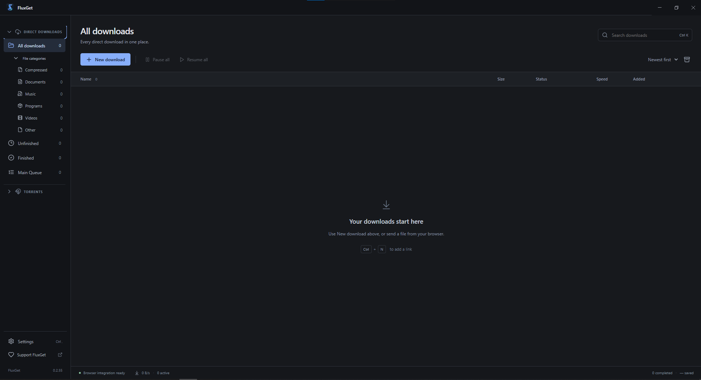

<div align="center">

# ⚡ FluxGet

### A modern download manager for Windows

**Fast Downloads • Video & Audio • BitTorrent • Browser Integration**



**Desktop v0.2.55** · Windows 10/11 · 64-bit

[Download for Windows](https://github.com/salahlarosa-art/FluxGet/releases/latest) · [Firefox Add-on](https://addons.mozilla.org/en-US/firefox/addon/fluxget/) · [Support FluxGet](https://ko-fi.com/salah_95)

</div>

---

## 🚀 What is FluxGet?

FluxGet is a modern Windows download manager designed to bring your downloads together in one place.

Download regular files, capture browser downloads, save supported public video and audio, manage BitTorrent transfers, control download speeds, and automatically organize downloaded files.

FluxGet runs locally on your Windows PC and integrates with Chrome/Chromium browsers and Firefox through companion extensions.

---

## ✨ Features

### ⚡ Accelerated Downloads

- HTTP and HTTPS downloads
- Up to **12 download ranges** for eligible files
- Automatic fallback to normal single-stream downloading when required
- Pause, resume, cancel and retry downloads
- Persistent download history across restarts
- Live download speed, progress and ETA
- Global and per-download speed limits
- Download queues with reordering controls
- Search, sorting, status filters and file-category filters

> Segmented downloading and resume support depend on the server supporting HTTP byte ranges.

### 🎬 Video & Audio

Download supported public video and audio directly through FluxGet.

- Video downloading and MP3 extraction
- Quality selection from **360p up to 4320p (8K)** when available
- MP4, WebM and MKV output options
- HLS (`.m3u8`) and DASH (`.mpd`) detection
- Support for many public media sites and video players
- `yt-dlp` included with packaged Windows builds
- Up to 8 connections/fragments for eligible prepared media
- Movable FluxGet download button on HTML5 video players
- Media detection for page players, embedded videos and scrolling feeds
- Automatic media filename detection

**FFmpeg is required** for media merging and MP3 conversion.

> DRM-protected, encrypted subscription and paywalled streams are not supported.

### 🧲 BitTorrent

FluxGet includes a BitTorrent engine powered by WebTorrent.

- Magnet links
- `.torrent` files
- Select individual files before downloading
- Pause and resume
- Torrent download queue
- Per-torrent download and upload limits
- Global torrent speed limits
- Peer, seed, speed, ETA and ratio information
- Configurable connection limits
- Optional automatic seeding
- Optional seed-ratio limit
- Windows `magnet:` protocol integration
- `.torrent` file association

### 🌐 Browser Integration

FluxGet integrates with **Chrome/Chromium browsers and Firefox**.

The extensions can:

- Capture normal browser downloads
- Add **Download with FluxGet** context-menu actions
- Send magnet links to FluxGet
- Detect supported public media
- Display a FluxGet download button over HTML5 videos
- Select video quality and output format
- Hand authenticated downloads from your current browser session to the desktop application

> FluxGet must be running for browser handoff to work.

---

## 🌐 Browser Extensions

### 🦊 Firefox

The official FluxGet Firefox extension is available from Mozilla Add-ons.

**[Install FluxGet for Firefox](https://addons.mozilla.org/en-US/firefox/addon/fluxget/)**

Current extension version: **0.2.46**

### 🌐 Chrome / Chromium

Install FluxGet directly from the official Chrome Web Store:

**[Install FluxGet for Chrome](https://chromewebstore.google.com/detail/fluxget-download-with-flu/onoiljcgbjdpbbkcfdbjlfknfghmfhlh)**

The extension connects your browser to the FluxGet desktop application for download capture, "Download with FluxGet" actions, magnet links, and supported video downloads.

> FluxGet must be running on your computer for the browser extension to send downloads to the desktop app.

The extension can also work with Chromium-family browsers such as Edge, Brave and Opera, subject to their extension policies.

---

## 📁 Automatic Download Organization

FluxGet automatically creates category folders inside your FluxGet download directory:

```text
FluxGet/
├── Compressed/
├── Videos/
├── Music/
├── Programs/
├── Documents/
└── Torrents/
```

New downloads are automatically routed to the appropriate folder based on their media type or filename extension.

Unknown file types remain in the main FluxGet folder.

---

## 🖥️ Windows Experience

FluxGet is designed as a native-looking Windows desktop application.

- Modern dark interface
- Compact transfer window
- Windows notifications
- System tray operation
- Optional start with Windows
- Configurable download directory
- Search, sorting and download filters
- Drag completed files into Explorer or the Desktop
- Automatic file organization
- Custom FluxGet application and browser icons

Closing the main FluxGet window can keep the download engine running in the system tray.

---

## 📥 Installation

### Requirements

- **Windows 10 or Windows 11**
- **64-bit system**
- **FFmpeg** for media merging and MP3 extraction

### Install FluxGet

1. Open the **[latest FluxGet release](https://github.com/salahlarosa-art/FluxGet/releases/latest)**.
2. Download `FluxGet-Setup-0.2.55.exe`.
3. Run the installer.
4. Read and accept the FluxGet End User License and Responsible Use Agreement.
5. Complete the installation.
6. Launch FluxGet.

### ⚠️ Windows SmartScreen

The current FluxGet installer is **not Authenticode signed**.

Windows SmartScreen may therefore display an **Unknown publisher** warning.

For safety, download FluxGet from this GitHub repository or official FluxGet links rather than unofficial mirrors.

---

## 🎞️ FFmpeg

FluxGet already includes `yt-dlp.exe` in packaged Windows builds.

**FFmpeg is currently installed separately** and is required for functionality such as:

- Combining separate video and audio streams
- Media processing
- MP3 extraction

FluxGet detects FFmpeg from your Windows PATH and common Windows installation locations.

---

## 🔒 Privacy

FluxGet performs downloads on your computer.

The browser extensions communicate with the FluxGet desktop application through a local connection:

```text
http://127.0.0.1:47824
```

No remote FluxGet server is used for this browser-to-desktop bridge.

For downloads that require your existing browser session, the extension may send the selected download or media URL, page referrer, cookies and required request headers to the **local FluxGet desktop process** so it can perform the requested transfer.

The current FluxGet application contains no FluxGet analytics service or advertising SDK.

For more information, read **[PRIVACY.md](PRIVACY.md)**.

---

## ⚖️ Responsible Use

FluxGet is intended for lawful downloading.

Only download files and media that you own or are authorized to save.

FluxGet does **not** support bypassing DRM, paywalls or access controls.

Users are responsible for complying with applicable laws, website terms and content rights.

---

## ⚠️ Known Limitations

- FluxGet Desktop is currently Windows-only
- The installer is 64-bit
- FFmpeg must currently be installed separately
- Website and media-player support can change when websites change
- Some websites may throttle, expire, encrypt or block media URLs
- DRM-protected and encrypted subscription streams are unsupported
- Download speed depends on the server, CDN, network, disk and protocol
- Resume and segmented downloading require compatible HTTP range support
- FluxGet must be running for browser-extension handoff
- Chrome extension installation is currently manual
- The Windows installer is currently unsigned

---

## 🛠️ Built With

FluxGet is a Windows desktop application built with modern desktop and web technologies.

Its download system includes dedicated engines for:

- Direct HTTP/HTTPS downloads
- Segmented file downloads
- HLS and DASH media
- Video and audio processing
- BitTorrent transfers
- Browser-to-desktop integration

FluxGet uses technologies including Electron, React, TypeScript, WebTorrent, yt-dlp and FFmpeg integration.

---

## ❤️ Support FluxGet

FluxGet is developed as an independent project and is available to download for free.

If you enjoy using FluxGet and want to support its continued development:

### ☕ [Support FluxGet on Ko-fi](https://ko-fi.com/salah_95)

Your support helps with continued development, testing and future improvements.

---

## 📄 License

Copyright © FluxGet.

**All Rights Reserved.**

FluxGet is distributed under the FluxGet End User License and Responsible Use Agreement.

This repository and FluxGet should not be considered open-source software unless the licensing is explicitly changed in the future.

---

<div align="center">

# ⚡ FluxGet

### Download smarter. Stay in control.

**[Download FluxGet](https://github.com/salahlarosa-art/FluxGet/releases/latest)** · **[Firefox Add-on](https://addons.mozilla.org/en-US/firefox/addon/fluxget/)** · **[Support Development](https://ko-fi.com/salah_95)**

**Desktop v0.2.55 · Extensions v0.2.46**

</div>
